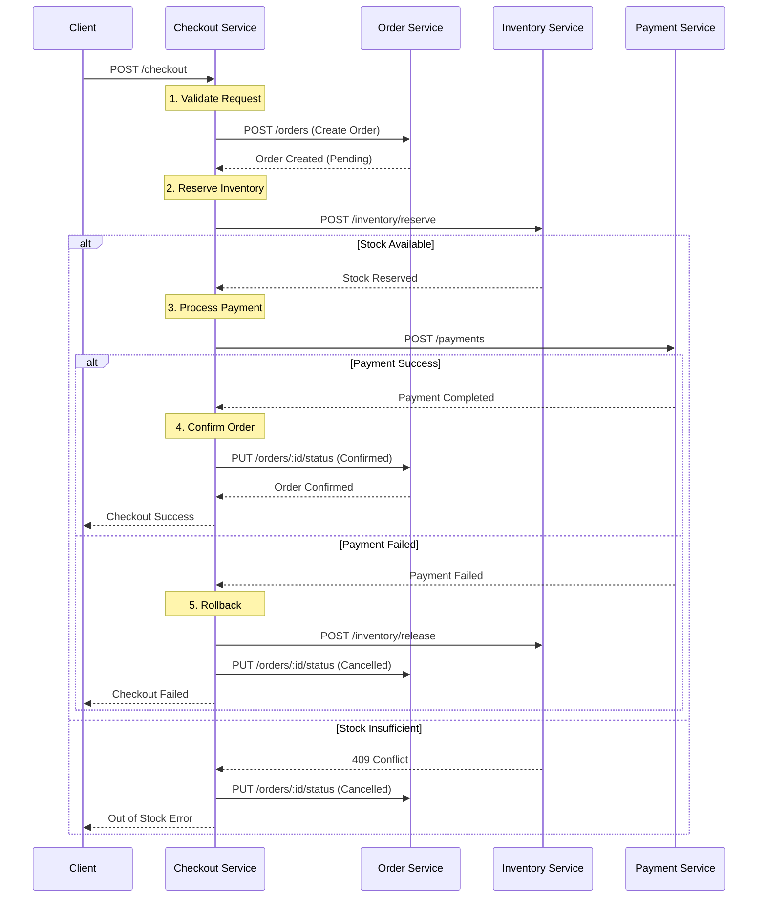

# Microservices Implementation Plan

## Technology-Agnostic Guide for Building an Online Marketplace

This comprehensive guide provides a complete blueprint for building a microservices-based online marketplace from scratch, independent of any specific technology stack.

---

## Table of Contents

1. [Architecture Overview](#architecture-overview)
2. [Database Schema Design](#database-schema-design)
3. [Service-by-Service Implementation Guide](#service-by-service-implementation-guide)
4. [Inter-Service Communication](#inter-service-communication)
5. [Implementation Sequence](#implementation-sequence)
6. [Testing Strategy](#testing-strategy)
7. [Deployment Considerations](#deployment-considerations)

---

### Core Architectural Principles

1. **Database-per-Service Pattern**: Each service owns its data
2. **API Gateway Pattern**: Single entry point for clients
3. **Service Autonomy**: Services can be deployed independently
4. **Technology Agnostic**: Each service can use different tech stacks
5. **Stateless Design**: Enable horizontal scaling

---

## Database Schema Design

### 1. Auth Service Database

**Database Name**: `auth_service`

**Collections/Tables**:

#### `users` Table

| Column | Type | Constraints | Description |
|--------|------|-------------|-------------|
| id | UUID/ObjectId | PRIMARY KEY | Unique identifier |
| name | String(255) | NOT NULL | Full name |
| email | String(255) | NOT NULL, UNIQUE | Email address |
| password_hash | String(255) | NOT NULL | Hashed password |
| role | Enum | NOT NULL, DEFAULT 'customer' | customer, admin, vendor |
| created_at | Timestamp | NOT NULL, DEFAULT NOW | Account creation time |
| updated_at | Timestamp | NOT NULL, DEFAULT NOW | Last update time |

**Indexes**:
- PRIMARY KEY: `id`
- UNIQUE INDEX: `email`

**database**:
- Postgres (Relational Database)


**Business Rules**:
- Password must be hashed (bcrypt, argon2, PBKDF2)
- Email format validation required
- Minimum password length: 6 characters

---

### 2. User Service Database

**Database Name**: `user_service`

**Collections/Tables**:

#### `user_profiles` Table

| Column | Type | Constraints | Description |
|--------|------|-------------|-------------|
| id | UUID/ObjectId | PRIMARY KEY | Unique identifier |
| user_id | UUID/String | NOT NULL, UNIQUE | Reference to auth service user |
| phone | String(20) | NULL | Contact number |
| created_at | Timestamp | NOT NULL, DEFAULT NOW | Profile creation time |
| updated_at | Timestamp | NOT NULL, DEFAULT NOW | Last update time |

#### `addresses` Table

| Column | Type | Constraints | Description |
|--------|------|-------------|-------------|
| id | UUID/ObjectId | PRIMARY KEY | Unique identifier |
| user_profile_id | UUID | NOT NULL, FOREIGN KEY | Reference to user_profile |
| street | String(255) | NULL | Street address |
| city | String(100) | NULL | City name |
| state | String(100) | NULL | State/Province |
| zip | String(20) | NULL | Postal code |
| country | String(100) | NULL | Country |
| is_default | Boolean | DEFAULT FALSE | Default address flag |

#### `user_preferences` Table

| Column | Type | Constraints | Description |
|--------|------|-------------|-------------|
| id | UUID/ObjectId | PRIMARY KEY | Unique identifier |
| user_profile_id | UUID | NOT NULL, FOREIGN KEY | Reference to user_profile |
| newsletter | Boolean | DEFAULT TRUE | Newsletter subscription |
| theme | String(20) | DEFAULT 'light' | UI theme preference |

**Indexes**:
- PRIMARY KEY: `id` on all tables
- UNIQUE INDEX: `user_id` on `user_profiles`
- INDEX: `user_profile_id` on `addresses` and `user_preferences`

**database**:
- Mongodb (NoSQL Database) -> Data in doc format.

---

### 3. Product Service Database

**Database Name**: `product_service`

#### `products` Table

| Column | Type | Constraints | Description |
|--------|------|-------------|-------------|
| id | UUID/ObjectId | PRIMARY KEY | Unique identifier |
| name | String(255) | NOT NULL | Product name |
|user_id | UUID/String | NOT NULL, UNIQUE | Reference to auth service user (role of user should be vendor or admin)|
| description | Text | NOT NULL | Product description |
| price | Decimal(10,2) | NOT NULL, CHECK >= 0 | Product price |
| category | String(100) | NOT NULL | Product category |
| images | JSON/Array | NULL | Image URLs |
| created_at | Timestamp | NOT NULL, DEFAULT NOW | Creation time |
| updated_at | Timestamp | NOT NULL, DEFAULT NOW | Last update time |

**database**:
- Mongodb (NoSQL Database) -> Data in doc format.

**Indexes**:
- PRIMARY KEY: `id`
- INDEX: `category`
- INDEX: `price`
- INDEX: `created_at` (for sorting)

---

### 4. Inventory Service Database

**Database Name**: `inventory_service`

#### `inventories` Table

| Column | Type | Constraints | Description |
|--------|------|-------------|-------------|
| id | UUID/ObjectId | PRIMARY KEY | Unique identifier |
| product_id | UUID/String | NOT NULL, UNIQUE | Reference to product |
| quantity | Integer | NOT NULL, CHECK >= 0 | Current stock |
| low_stock_threshold | Integer | DEFAULT 10 | Alert threshold |
| last_updated | Timestamp | NOT NULL, DEFAULT NOW | Last inventory update |


**database**:
- Postgres (Relational Database)

**Indexes**:
- PRIMARY KEY: `id`
- UNIQUE INDEX: `product_id`
- INDEX: `quantity, low_stock_threshold` (for low stock queries)

---

### 5. Order Service Database

**Database Name**: `order_service`

#### `carts` Table

| Column | Type | Constraints | Description |
|--------|------|-------------|-------------|
| id | UUID/ObjectId | PRIMARY KEY | Unique identifier |
| user_id | UUID/String | NOT NULL, UNIQUE | Reference to user |
| total_price | Decimal(10,2) | DEFAULT 0 | Calculated total |
| updated_at | Timestamp | NOT NULL, DEFAULT NOW | Last update time |

#### `cart_items` Table

| Column | Type | Constraints | Description |
|--------|------|-------------|-------------|
| id | UUID/ObjectId | PRIMARY KEY | Unique identifier |
| cart_id | UUID | NOT NULL, FOREIGN KEY | Reference to cart |
| product_id | UUID/String | NOT NULL | Reference to product |
| name | String(255) | NULL | Product name (denormalized) |
| price | Decimal(10,2) | NULL | Product price (denormalized) |
| quantity | Integer | DEFAULT 1 | Item quantity |

#### `orders` Table

| Column | Type | Constraints | Description |
|--------|------|-------------|-------------|
| id | UUID/ObjectId | PRIMARY KEY | Unique identifier |
| user_id | UUID/String | NOT NULL | Reference to user |
| total_amount | Decimal(10,2) | NOT NULL | Total order amount |
| status | Enum | NOT NULL, DEFAULT 'Pending' | Order status |
| created_at | Timestamp | NOT NULL, DEFAULT NOW | Order creation time |
| updated_at | Timestamp | NOT NULL, DEFAULT NOW | Last update time |

**Status Enum**: `Pending`, `Confirmed`, `Shipped`, `Delivered`, `Cancelled`

#### `order_items` Table

| Column | Type | Constraints | Description |
|--------|------|-------------|-------------|
| id | UUID/ObjectId | PRIMARY KEY | Unique identifier |
| order_id | UUID | NOT NULL, FOREIGN KEY | Reference to order |
| product_id | UUID/String | NOT NULL | Reference to product |
| name | String(255) | NULL | Product name (snapshot) |
| price | Decimal(10,2) | NULL | Price at order time |
| quantity | Integer | NOT NULL | Quantity ordered |

#### `shipping_addresses` Table

| Column | Type | Constraints | Description |
|--------|------|-------------|-------------|
| id | UUID/ObjectId | PRIMARY KEY | Unique identifier |
| order_id | UUID | NOT NULL, FOREIGN KEY | Reference to order |
| street | String(255) | NULL | Street address |
| city | String(100) | NULL | City name |
| zip | String(20) | NULL | Postal code |
| country | String(100) | NULL | Country |


**database**:
- Postgres (Relational Database)

**Indexes**:
- PRIMARY KEY: `id` on all tables
- UNIQUE INDEX: `user_id` on `carts`
- INDEX: `user_id` on `orders`
- INDEX: `status` on `orders`
- INDEX: `cart_id` on `cart_items`
- INDEX: `order_id` on `order_items` and `shipping_addresses`

---

### 6. Payment Service Database

**Database Name**: `payment_service`

#### `transactions` Table

| Column | Type | Constraints | Description |
|--------|------|-------------|-------------|
| id | UUID/ObjectId | PRIMARY KEY | Unique identifier |
| user_id | UUID/String | NOT NULL | Reference to user |
| amount | Decimal(10,2) | NOT NULL | Transaction amount |
| currency | String(3) | DEFAULT 'USD' | Currency code |
| status | Enum | NOT NULL, DEFAULT 'Pending' | Transaction status |
| payment_method | String(50) | DEFAULT 'Credit Card' | Payment method |
| provider_transaction_id | String(255) | NULL | External gateway ID |
| created_at | Timestamp | NOT NULL, DEFAULT NOW | Transaction time |


**database**:
- Postgres (Relational Database)

**Status Enum**: `Pending`, `Completed`, `Failed`

**Indexes**:
- PRIMARY KEY: `id`
- INDEX: `user_id`
- INDEX: `provider_transaction_id`
- INDEX: `status`

---

## Service-by-Service Implementation Guide

### Service 1: Auth Service

**Purpose**: Handle user authentication and authorization

**Technology Options**:
- Java: Spring Boot + Spring Security
- .NET: ASP.NET Core Identity
- Node.js: Express + Passport.js
- Python: FastAPI + OAuth2
- Go: Gin + JWT-go

**API Routes**:

#### POST `/api/auth/register`
- **Purpose**: Register new user
- **Request Body**:
```json
{
  "name": "string",
  "email": "string",
  "password": "string",
  "role": "customer|admin|vendor"
}
```
- **Response**: 201 Created
```json
{
  "success": true,
  "message": "User registered successfully",
  "data": {
    "id": "uuid",
    "name": "string",
    "email": "string",
    "role": "string"
  }
}
```
- **Error Responses**: 400 (Validation), 409 (Email exists)

**Implementation Steps**:
1. Validate input data
2. Check if email already exists
3. Hash password
4. Create user record
5. Return user data (exclude password)

---

#### POST `/api/auth/login`
- **Purpose**: Authenticate user
- **Request Body**:
```json
{
  "email": "string",
  "password": "string"
}
```
- **Response**: 200 OK
```json
{
  "success": true,
  "token": "jwt_token_string",
  "user": {
    "id": "uuid",
    "name": "string",
    "email": "string",
    "role": "string"
  }
}
```
- **Error Responses**: 401 (Invalid credentials), 400 (Validation)

**Implementation Steps**:
1. Validate input
2. Find user by email
3. Verify password hash
4. Generate JWT token (include user_id, role in payload)
5. Return token and user data

---

### Service 2: User Service

**Purpose**: Manage user profiles, addresses, and preferences

**API Routes**:

#### GET `/api/users/profile`
- **Auth Required**: Yes (JWT)
- **Purpose**: Get current user's profile
- **Response**: 200 OK
```json
{
  "success": true,
  "data": {
    "userId": "uuid",
    "phone": "string",
    "addresses": [...],
    "preferences": {...}
  }
}
```

**Implementation Steps**:
1. Extract user_id from JWT token
2. Query user profile by user_id
3. Return profile data

---

#### PUT `/api/users/profile`
- **Auth Required**: Yes (JWT)
- **Purpose**: Update user profile
- **Request Body**:
```json
{
  "phone": "string",
  "preferences": {
    "newsletter": boolean,
    "theme": "string"
  }
}
```
- **Response**: 200 OK

**Implementation Steps**:
1. Extract user_id from JWT
2. Validate input
3. Update profile fields
4. Return updated profile

---

#### POST `/api/users/address`
- **Auth Required**: Yes (JWT)
- **Purpose**: Add new address
- **Request Body**:
```json
{
  "street": "string",
  "city": "string",
  "state": "string",
  "zip": "string",
  "country": "string",
  "isDefault": boolean
}
```
- **Response**: 201 Created

**Implementation Steps**:
1. Extract user_id from JWT
2. Validate address data
3. If isDefault=true, unset other default addresses
4. Create new address record
5. Return created address

---

#### GET `/api/users/addresses`
- **Auth Required**: Yes (JWT)
- **Purpose**: List all user addresses
- **Response**: 200 OK

#### PUT `/api/users/address/:id`
- **Auth Required**: Yes (JWT)
- **Purpose**: Update address

#### DELETE `/api/users/address/:id`
- **Auth Required**: Yes (JWT)
- **Purpose**: Delete address

---

### Service 3: Product Service

**Purpose**: Manage product catalog

**API Routes**:

#### GET `/api/products`
- **Auth Required**: No
- **Purpose**: List all products (with pagination)
- **Query Parameters**:
  - `page`: Page number (default: 1)
  - `limit`: Items per page (default: 20)
  - `category`: Filter by category
  - `minPrice`: Minimum price
  - `maxPrice`: Maximum price
- **Response**: 200 OK
```json
{
  "success": true,
  "data": [...],
  "pagination": {
    "page": 1,
    "limit": 20,
    "total": 100
  }
}
```

**Implementation Steps**:
1. Parse query parameters
2. Build database query with filters
3. Apply pagination
4. Return products with pagination metadata

---

#### GET `/api/products/:id`
- **Auth Required**: No
- **Purpose**: Get single product
- **Response**: 200 OK

---

#### POST `/api/products`
- **Auth Required**: Yes (Admin/Vendor only)
- **Purpose**: Create new product
- **Request Body**:
```json
{
  "name": "string",
  "description": "string",
  "price": number,
  "category": "string",
  "images": ["url1", "url2"]
}
```
- **Response**: 201 Created

**Implementation Steps**:
1. Verify JWT and check role
2. Validate product data
3. Create product record
4. Return created product

---

#### PUT `/api/products/:id`
- **Auth Required**: Yes (Admin/Vendor only)
- **Purpose**: Update product

#### DELETE `/api/products/:id`
- **Auth Required**: Yes (Admin/Vendor only)
- **Purpose**: Delete product

---

### Service 4: Inventory Service

**Purpose**: Manage stock levels

**API Routes**:

#### GET `/api/inventory/:productId`
- **Auth Required**: No
- **Purpose**: Get stock level for product
- **Response**: 200 OK
```json
{
  "success": true,
  "data": {
    "productId": "uuid",
    "quantity": 100,
    "lowStockThreshold": 10,
    "isLowStock": false
  }
}
```

---

#### POST `/api/inventory/add`
- **Auth Required**: Yes (Admin only)
- **Purpose**: Add/Update inventory
- **Request Body**:
```json
{
  "productId": "uuid",
  "quantity": number,
  "lowStockThreshold": number
}
```
- **Response**: 200 OK

**Implementation Steps**:
1. Verify admin authorization
2. Check if inventory exists
3. If exists: update quantity (increment)
4. If not: create new inventory record
5. Return updated inventory

---

#### POST `/api/inventory/reserve`
- **Auth Required**: Yes (Service-to-service)
- **Purpose**: Reserve stock for order
- **Request Body**:
```json
{
  "productId": "uuid",
  "quantity": number
}
```
- **Response**: 200 OK or 409 Conflict

**Implementation Steps**:
1. Lock inventory record (transaction)
2. Check if sufficient stock
3. If yes: decrement quantity
4. If no: return 409 error
5. Commit or rollback transaction

---

#### POST `/api/inventory/release`
- **Auth Required**: Yes (Service-to-service)
- **Purpose**: Release reserved stock (order cancelled)
- **Request Body**:
```json
{
  "productId": "uuid",
  "quantity": number
}
```

**Implementation Steps**:
1. Increment quantity back
2. Return success

---

#### GET `/api/inventory/status/low-stock`
- **Auth Required**: Optional
- **Purpose**: Get products with low stock
- **Response**: 200 OK
```json
{
  "success": true,
  "data": [
    {
      "productId": "uuid",
      "quantity": 5,
      "lowStockThreshold": 10
    }
  ]
}
```

**Implementation Steps**:
1. Query where quantity < lowStockThreshold
2. Return list

---

### Service 5: Order Service

**Purpose**: Manage shopping carts and orders

**API Routes**:

#### POST `/api/orders/cart/add`
- **Auth Required**: Yes (JWT)
- **Purpose**: Add item to cart
- **Request Body**:
```json
{
  "productId": "uuid",
  "name": "string",
  "price": number,
  "quantity": number
}
```
- **Response**: 200 OK

**Implementation Steps**:
1. Extract user_id from JWT
2. Get or create cart for user
3. Check if item already in cart
4. If yes: update quantity
5. If no: add new cart item
6. Recalculate total_price
7. Return updated cart

---

#### GET `/api/orders/cart`
- **Auth Required**: Yes (JWT)
- **Purpose**: Get user's cart
- **Response**: 200 OK
```json
{
  "success": true,
  "data": {
    "id": "uuid",
    "items": [...],
    "totalPrice": number
  }
}
```

---

#### DELETE `/api/orders/cart/remove`
- **Auth Required**: Yes (JWT)
- **Purpose**: Remove item from cart
- **Request Body**:
```json
{
  "productId": "uuid"
}
```

**Implementation Steps**:
1. Get user's cart
2. Remove item matching productId
3. Recalculate total_price
4. Return updated cart

---

#### DELETE `/api/orders/cart/clear`
- **Auth Required**: Yes (JWT)
- **Purpose**: Clear entire cart

---

#### GET `/api/orders`
- **Auth Required**: Yes (JWT)
- **Purpose**: Get user's order history
- **Response**: 200 OK
```json
{
  "success": true,
  "data": [
    {
      "id": "uuid",
      "items": [...],
      "totalAmount": number,
      "status": "string",
      "createdAt": "timestamp"
    }
  ]
}
```

---

#### GET `/api/orders/:id`
- **Auth Required**: Yes (JWT)
- **Purpose**: Get order details

---

#### POST `/api/orders` (Internal)
- **Auth Required**: Service-to-service
- **Purpose**: Create order from cart
- **Request Body**:
```json
{
  "userId": "uuid",
  "shippingAddress": {...}
}
```

**Implementation Steps**:
1. Get user's cart
2. Validate cart not empty
3. Create order record
4. Copy cart items to order items
5. Set order status to 'Pending'
6. Save shipping address
7. Clear cart
8. Return order

---

#### PUT `/api/orders/:id/status` (Internal)
- **Auth Required**: Service-to-service
- **Purpose**: Update order status
- **Request Body**:
```json
{
  "status": "Confirmed|Shipped|Delivered|Cancelled"
}
```

---

### Service 6: Checkout Service

**Purpose**: Orchestrate checkout process

**API Routes**:

#### POST `/api/checkout`
- **Auth Required**: Yes (JWT)
- **Purpose**: Process checkout
- **Request Body**:
```json
{
  "shippingAddress": {
    "street": "string",
    "city": "string",
    "zip": "string",
    "country": "string"
  },
  "paymentMethod": "string"
}
```
- **Response**: 200 OK
```json
{
  "success": true,
  "orderId": "uuid",
  "transactionId": "uuid",
  "message": "Order placed successfully"
}
```

**Implementation Flow** (Critical):



**Implementation Steps**:
1. Extract user_id from JWT
2. Validate shipping address
3. **Call Order Service**: Create order (status: Pending)
4. **Call Inventory Service**: Reserve stock for each item
   - If insufficient stock: Cancel order and return error
5. **Call Payment Service**: Process payment
   - If payment fails: Release stock, cancel order, return error
6. **Call Order Service**: Update order status to 'Confirmed'
7. Return success with order_id and transaction_id

**Error Handling**:
- Implement compensation logic for failures
- Release inventory if payment fails
- Cancel order if inventory reservation fails
- Use timeouts for service calls

---

### Service 7: Payment Service

**Purpose**: Process payments

**API Routes**:

#### POST `/api/payments`
- **Auth Required**: Yes (Service-to-service or JWT)
- **Purpose**: Process payment
- **Request Body**:
```json
{
  "userId": "uuid",
  "amount": number,
  "currency": "string",
  "paymentMethod": "string"
}
```
- **Response**: 200 OK
```json
{
  "success": true,
  "data": {
    "transactionId": "uuid",
    "status": "Completed",
    "providerTransactionId": "string"
  }
}
```

**Implementation Steps**:
1. Validate payment data
2. Create transaction record (status: Pending)
3. Call external payment gateway API
4. If success: Update status to 'Completed'
5. If failure: Update status to 'Failed'
6. Return transaction details

---

#### GET `/api/payments/:transactionId`
- **Auth Required**: Yes (JWT)
- **Purpose**: Get transaction details

---

## Inter-Service Communication

### Communication Patterns

#### 1. Synchronous HTTP/REST
```
Service A --HTTP POST--> Service B
         <--JSON Response--
```

**When to Use**: Real-time operations (checkout, cart operations)

**Implementation**:
- Use HTTP client library in your language
- Include timeout and retry logic
- Handle connection failures gracefully

---

#### 2. gRPC (Alternative)
```
Service A --gRPC Call--> Service B
         <--Protobuf Response--
```

**When to Use**: High-performance inter-service calls

**Benefits**:
- Faster than REST
- Strongly typed contracts
- Built-in load balancing

---

### Service Communication Matrix

| Caller Service | Called Service | Method | Purpose |
|----------------|----------------|--------|---------|
| Checkout | Order | POST /orders | Create order |
| Checkout | Order | PUT /orders/:id/status | Update order status |
| Checkout | Inventory | POST /inventory/reserve | Reserve stock |
| Checkout | Inventory | POST /inventory/release | Release stock |
| Checkout | Payment | POST /payments | Process payment |
| Order | Inventory | GET /inventory/:productId | Validate stock (optional) |

### Authentication for Inter-Service Calls


**API Gateway Internal Routing**
- Gateway handles authentication
- Services trust internal network

---

## Implementation Sequence

### Phase 1: Foundation Services (Week 1-2)

#### Step 1: Setup Infrastructure
- [ ] Choose database (MongoDB, PostgreSQL, MySQL)
- [ ] Setup API Gateway (NGINX, Kong, AWS API Gateway)
- [ ] Configure service network
- [ ] Setup containerization (Docker)

#### Step 2: Implement Auth Service
- [ ] Create database schema
- [ ] Implement registration endpoint
- [ ] Implement login endpoint
- [ ] Setup JWT generation
- [ ] Add password hashing
- [ ] Create authentication middleware
- [ ] Test endpoints

#### Step 3: Implement User Service
- [ ] Create database schema
- [ ] Implement profile endpoints
- [ ] Implement address management
- [ ] Add JWT verification
- [ ] Test endpoints

---

### Phase 2: Catalog Services (Week 3)

#### Step 4: Implement Product Service
- [ ] Create database schema
- [ ] Implement CRUD endpoints
- [ ] Add pagination
- [ ] Add filtering and search
- [ ] Test endpoints

#### Step 5: Implement Inventory Service
- [ ] Create database schema
- [ ] Implement stock management
- [ ] Implement reserve/release endpoints
- [ ] Add low stock alerts
- [ ] Test stock operations

---

### Phase 3: Transaction Services (Week 4)

#### Step 6: Implement Order Service
- [ ] Create database schema
- [ ] Implement cart management
- [ ] Implement order creation
- [ ] Add order history
- [ ] Test cart and order flows

#### Step 7: Implement Payment Service
- [ ] Create database schema
- [ ] Integrate payment gateway (Stripe, PayPal)
- [ ] Implement payment processing
- [ ] Add transaction records
- [ ] Test payment flows

---

### Phase 4: Orchestration (Week 5)

#### Step 8: Implement Checkout Service
- [ ] Implement checkout orchestration
- [ ] Add service-to-service calls
- [ ] Implement compensation logic
- [ ] Add error handling
- [ ] Test complete checkout flow

---

### Phase 5: Integration & Testing (Week 6)

#### Step 9: Integration Testing
- [ ] End-to-end user journey tests
- [ ] Service communication tests
- [ ] Error scenario tests
- [ ] Performance testing

#### Step 10: Gateway Configuration
- [ ] Configure routing rules
- [ ] Add rate limiting
- [ ] Setup SSL/TLS
- [ ] Add request logging

---

## Testing Strategy

### 1. Unit Testing
Test individual functions/methods in isolation

**For Each Service**:
- Test business logic
- Test validation functions
- Test database operations
- Target: 80%+ code coverage

---

### 2. Integration Testing
Test service-to-service interactions

**Test Scenarios**:
- Auth flow: Register → Login → Get Profile
- Shopping flow: Add to Cart → Checkout → Verify Order
- Inventory flow: Create Product → Reserve Stock → Release Stock

---

### 3. End-to-End Testing
Test complete user journeys

**Happy Path Test**:
```
1. Register user
2. Login
3. Browse products
4. Add to cart
5. Checkout
6. Verify order created
7. Verify stock reduced
8. Verify payment recorded
```

**Error Scenarios**:
- Insufficient stock during checkout
- Payment failure
- Invalid authentication
- Cart operations without login

---

### 4. Load Testing
Test system under high concurrency

**Tools**: JMeter, Gatling, K6

**Scenarios**:
- Concurrent user registrations
- Simultaneous checkouts
- High-volume product browsing

---

## Deployment Considerations

### 1. Containerization

**Dockerfile Template**:
```dockerfile
FROM <base-image>
WORKDIR /app
COPY . .
RUN <install-dependencies>
EXPOSE <port>
CMD <start-command>
```

---

### 2. Service Discovery

**Options**:
- **Consul**: Service registry and health checks
- **Eureka**: Netflix service discovery
- **Kubernetes DNS**: Built-in service discovery

---

### 3. Load Balancing

**Options**:
- NGINX load balancer
- HAProxy
- Cloud load balancers (AWS ALB, GCP Load Balancer)

---

### 4. Monitoring & Logging

**Logging**:
- Centralized logging (ELK Stack, Splunk)
- Structured logging (JSON format)
- Correlation IDs for request tracing

**Monitoring**:
- Prometheus + Grafana
- Datadog, New Relic
- Track: Response time, error rate, throughput

---

### 5. Security Checklist

- [ ] HTTPS/TLS for all external APIs
- [ ] JWT with expiration
- [ ] Input validation on all endpoints
- [ ] SQL injection prevention (parameterized queries)
- [ ] Rate limiting on API Gateway
- [ ] Secrets management (Vault, AWS Secrets Manager)
- [ ] CORS configuration
- [ ] Database encryption at rest

---

### 6. Scalability Considerations

**Horizontal Scaling**:
- Stateless service design
- Load balancer distribution
- Auto-scaling based on CPU/memory

**Database Scaling**:
- Read replicas
- Database sharding
- Caching layer (Redis, Memcached)

---

## Technology Stack Recommendations

### Backend Frameworks

| Language | Framework | Best For |
|----------|-----------|----------|
| Java | Spring Boot | Enterprise, microservices |
| C# | ASP.NET Core | Windows, enterprise |
| Node.js | Express/NestJS | Fast development, real-time |
| Python | FastAPI/Django | Data-heavy, ML integration |
| Go | Gin/Echo | High performance, cloud-native |
| Kotlin | Ktor | Modern JVM apps |

### Databases

| Type | Database | Best For |
|------|----------|----------|
| Document | MongoDB | Flexible schemas |
| Relational | PostgreSQL | ACID compliance, complex queries |
| Relational | MySQL | Web applications |
| In-Memory | Redis | Caching, sessions |

### API Gateway

| Tool | Best For |
|------|----------|
| NGINX | Simple routing, reverse proxy |
| Kong | Plugin ecosystem, enterprise |
| AWS API Gateway | AWS cloud deployments |
| Traefik | Kubernetes, cloud-native |

---

## Conclusion

This implementation plan provides a complete blueprint for building a production-ready microservices architecture. Follow the phases sequentially, implement comprehensive testing at each stage, and ensure proper monitoring and security measures are in place before production deployment.

**Key Success Factors**:
1. Start with foundation services
2. Test thoroughly at each phase
3. Implement proper error handling
4. Plan for scalability from day one
5. Monitor and log everything
6. Document as you build
